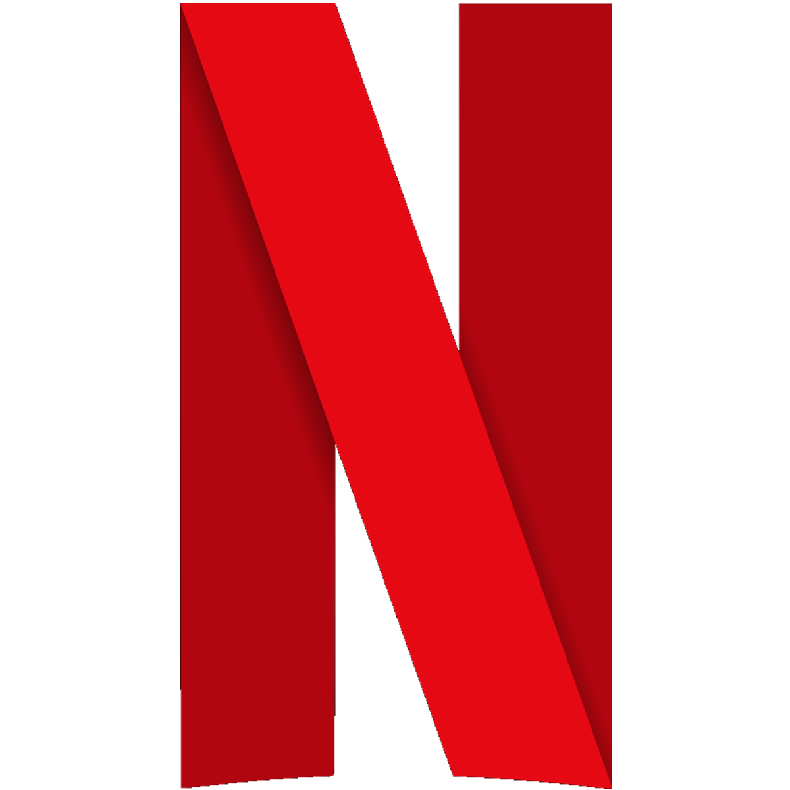

<!-- PROJECT LOGO -->
<br />
<div align="center">
  <a href="">
    
  </a>

  <h3 align="center">Netflix</h3>

  <p align="center">
    Mochamad Ridwan | Univeritas Muria Kudus
  </p>
</div>

<!-- ABOUT THE PROJECT -->
## About The Project
<div align="center">
   
</div>

## Built With

* Node Js 18.12.1 Latest
* NPM 8.19.2
* PHP 8.0.2 
* Laravel 9.19
* Laravel Breeze 9.19
* Tailwind CSS 3.2.4
* Daisy UI Component 2.46.0
* MySQL

## Tools

* Visual Studio Code 
* Firefox
* XAMPP
* DBVear

## References

* https://laravel.com/docs/9.x
* https://tailwindcss.com/docs/installation
* https://daisyui.com/components/
* https://stackoverflow.com/
* https://tugasakhir.id/crud-gambar-laravel/
* https://www.netflix.com/id/

## Getting Started

This is an example of how you may give instructions on setting up your project locally.
To get a local copy up and running follow these simple example steps.

### Prerequisites

This is an example of how to list things you need to use the software and how to install them.
* npm
  ```sh
  npm install npm@latest -g
  ```

### Installation

Below is an example of how you can instruct your audience on installing and setting up your app. This template doesn't rely on any external dependencies or services.
1. Clone the repo
   ```sh
   git clone https://github.com/mchridwan04/netflix.git
   ```
2. Install NPM packages
   ```sh
   npm install
   ```
3. Migration Database
   ```sh
   php artisan migrate
   ```
4. Run aplication
   ```sh
   php artisan serve
   ```
   ```sh
   npm run dev
   ```
